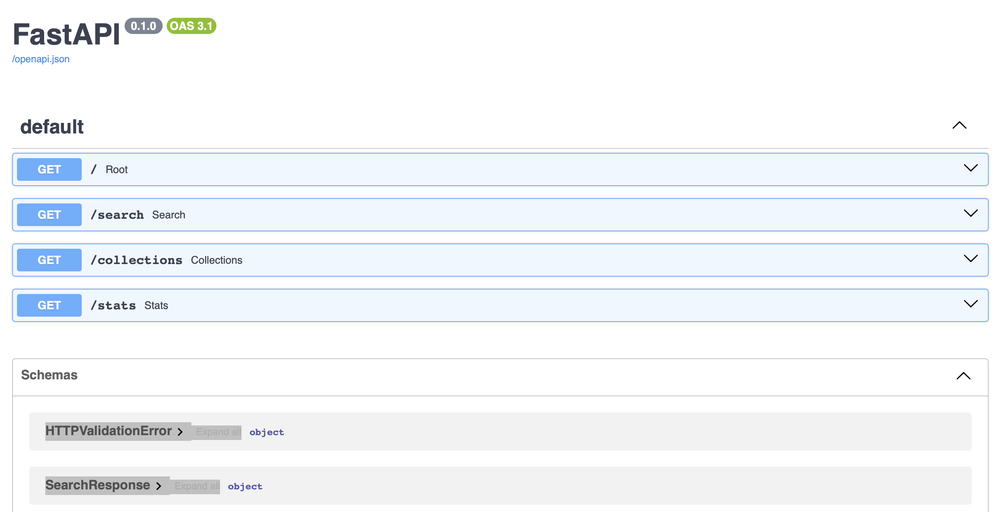
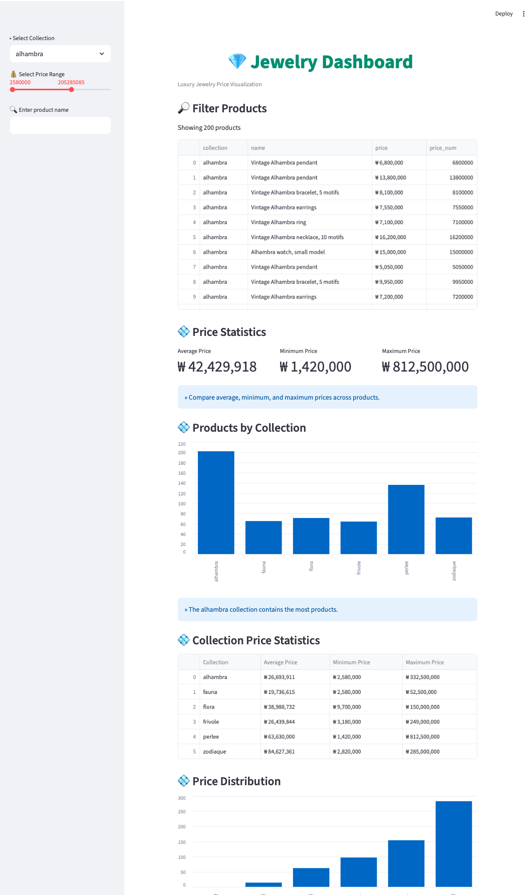

## Jewelry Data Pipeline & Dashboard

주얼리 상품 데이터를 수집 PostgreSQL에 저장,  
FAST API와 Streamlit Dashboard를 통해  
검색 및 가격 분석 기능을 구현한 프로젝트입니다.

## Tech Stack 

* Python
* Selenium
* FastAPI
* PostgreSQL
* Pandas
* Streamlit

## Features

* Dynamic Web Crawling (Infinite Scroll, Load More)
* JSON Data Parsing & Deduplication
* PostgreSQL Data Storage
* REST API Development
* Interactive Dashboard Visualization

## Architecture

Crawler → PostgreSQL → FastAPI → Streamlit Dashboard

```text
JEWELRY
├── app          # FastAPI, Streamlit
├── assets       # README screenshots
├── crawler      # Selenium crawler
├── data         # Crawled dataset
├── .gitignore
├── LICENSE
└── README.md
```

## API

| Endpoint         | Description |
| ---------------- | ----------- |
| GET /search      | 상품 검색       |
| GET /collections | 컬렉션 조회      |
| GET /stats       | 상품 통계       |


## Run

```bash
source .venv/bin/activate
uvicorn app.main:app --reload
streamlit run app/app.py
```

## API Preview



## Dashboard Preview

